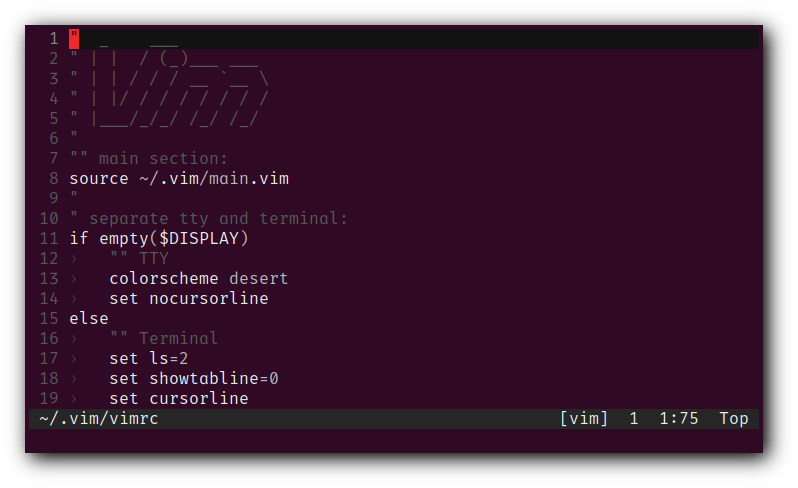
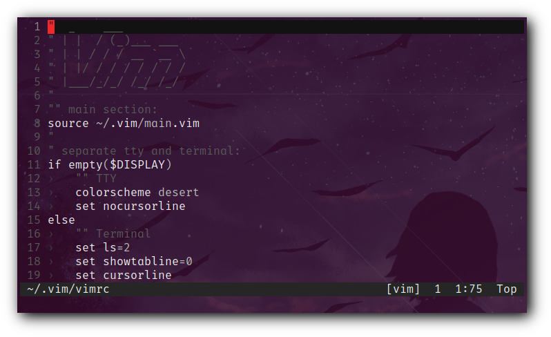
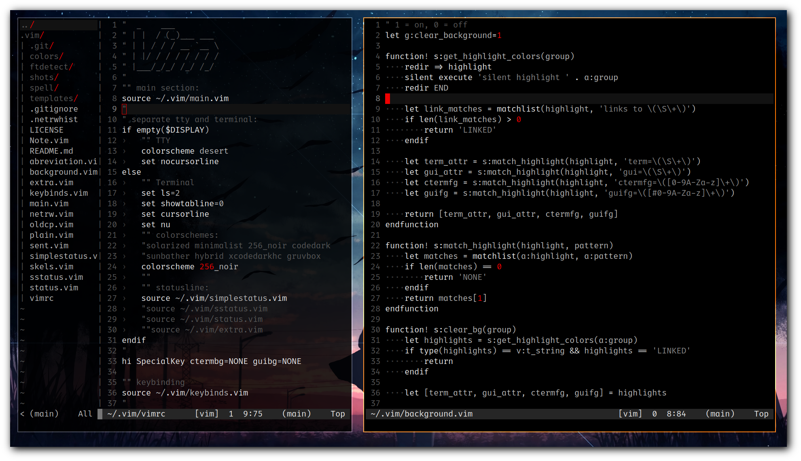

# vim

Hos's vim configuration (Plugin-free)

Vim will have separate colorschemes and configurations
for Terminal and TTY in this setup.

- Terminal
    - colorscheme: hybrid
- TTY
    - colorscheme: desert

```bash
if [[ ! -z "${questions}" ]]; then
    echo "Keep reading ;)"
else
    echo "Have fun and goodbye <3"
    exit 0
fi
```

```bash
for questions in ${mind}
do
    echo ${questions}
done
```

- Dependencies:
    - `git` for status-line to show the current git branch.
    - compositor if wanna use `background.vim` to have a transparent background.

## Shortcuts:

**Normal Mode**

| Command      | Description                 |
|--------------|-----------------------------|
| `<leader>fe` | Compile current file        |
| `<leader>fw` | Run current file            |
| `<leader>ff` | Open netrw file-manager     |
| `<leader>cc` | Run `make` command          |
| `<leader>ss` | Enable spell-check          |
| `-`          | Comment line(s)             |
| `+`          | Uncomment line(s)           |

- `-` and `+` also works in Visual-X mode.

**Command mode**

| Command      | Description                         |
|--------------|-------------------------------------|
| `WW`         | Write current file with root access |
| `Q`          | An alias to `qa` command (quit-all) |

Let's take a closer look, shall we? :)

## Files

I have all of my configurations in separate files.
One file for keybindings, another for statusline configs and so on.
In each file, I have some kind of settings.

### vimrc

This is the init file which `vim` reads settings from this.
And I source all my config files in it.
Also there is a section, just an `if` statement to say

> if vim opened in a tty, set this colorscheme and do this
>
> if vim opened inside of a Terminal, do these and use this colorscheme

You get the idea ;)

### main.vim

This file contains some of basic settings like

- Line numbering
- No vi compatibility
- Set clipboard
- etc...

### abreviation.vim

This is the fun part. I have three functions in this file.

All these three functions do is
mapping some ascii characters like `•`, `→`, `⇒`
to some common symbols like `.`, `->`, `=>`
and let us to toggle [for enable and disable these maps]
between two functions.

One function to activate, one for deactivate,
and one for toggle between those two functions.

The keybinding for toggling is `<space><space>a` in normal mode.

### keybinds.vim

I keep most of my key mappings in this file.
Thinks like

- `<leader>ss` to execute `:setlocal spell!<CR>`
- `<leader>se` to execute `:set spelllang=en_us<CR>`
- `<C-p>` to execute `:set paste!`
- etc...

I'm used to have `\` as leader key.
You can set `mapleader` to something else like `,`.
See `keybinds.vim` file, line 8.

```vim
"" <Leader> key section
let mapleader='\'      " change the <Leader> Key
```

### skels.vim

If you want to set the leader key [or anything] to `,`
note that I have `,` set to read some template files located in
`$HOME/.vim/templates/` directory to the current file.

Take a look at `skels.vim` file, line 8, `g:skelkey` variable,
for changing the `g:skelkey` which I it set to `,` by default.

```vim
"" add ready-to-use text by .ext
let g:skelkey=','
```

### netrw.vim

Vim's built-in file manager `netrw` configs.

Contains some `autocmd`s for:

- Start netrw at startup
    - To disable this functionality, simply set value `1` to the
    `g:NetrwIsOpen` variable in this file:
    ```vim
    " open netrw on startup (0 = on, 1 = off)
    let g:NetrwIsOpen=1
    ```

And functions for

- Toggle netrw
- Refresh netrw to update the display

### extra.vim

This file, as you guess from it's name,
have some extra settings and features enabled.
Things like:

- Auto fill `{ } [ ] ( )`
    - Has a keybinding to enable/disable
    - Fills markdown's `* *` and `_ _`
        - This will be only enabled on markdown files, and cannot be turned off
          [Didn't set that :)]
- don't expand tab in `make` filetype [makefiles]
- enable `filetype plugin` and `filetype indent`
- also it has the `plugins`

### oldcp.vim

This file is for compile/execute programs/scripts.

That's all you need to know but, if want to, you can take a look ;)

Syntax is like

```vim
autocmd FileType <File_type> nnoremap <Key_binding> :!<Command><CR>
```

### background.vim

`vim-transparent` plugin.
to make colorschemes to respect terminals transparency.

set `g:clear_background` variable to
    - `0` to disable
    - `1` to enable

the transparency.

**Keep that in mind**

- when enabling this section, vim will have no background color.
thus your background will be your terminal's background color.

| On terminal with no transparency | On terminal with transparency |
|:--------------------------------:|:--------------------------------:|
|  |  |

- this functionality will work on **most** of colorscheme, not **all**.

```vim
let g:clear_background=0
```

### {status,sstatus,simplestatus}.vim

This file[s] is just status line.

I do not use a plugin for this. It's all just vim's built-in status line.

### Other files

- `plain.vim`
    - It is a very very lightweight config file
    - It is not using any plugins
    - The most external tool it use is `netrw`
    - I did not included it in `vimrc` file
    - Give it a try: `vim -u $PWD/plain.vim ~/.bashrc`

## Directories

There is also some directories in the `$HOME/.vim` dir, right?

Wanna know what are those?!

```bash
case $1 in
    yes)
    echo "Keep reading ;)"
        ;;
    *)
    echo "Have a nice life, take care <3"
    exit 0
        ;;
esac
```

### colors

It's obvious right? It contains color-schemes :)))

#### Available colors

1. 256_noir.vim
1. codedark.vim
1. gruvbox.vim
1. hybrid_material.vim
1. hybrid_reverse.vim
1. hybrid.vim
1. minimalist.vim
1. monochrome.vim
1. solarized.vim
1. sunbather.vim
1. xcodedarkhc.vim
1. xcodedark.vim
1. xcodelighthc.vim
1. xcodelight.vim
1. xcodewwdc.vim

### ftdetect

Oh this one! I wrote a very small syntax highlighter
[about 5 line of code in total XD] for files with `.sent` extension.
In this directory, basically I told vim

> Hey! `*.sent` files are a kind! Treat the as they are `sent`

And in sent.vim file, I defined the color scheme [just has 3 or 4 lines, nothing serious]

### spell

If you install a new dictionary [which vim needs to download it]
guess what? :)) it will keep the dictionary files here.

### templates

This is where I keep my skeleton/template files, call them whatever you like
I don't care XD

## Screenshots



Shout out to Luke Smith, DT, and all other people who I've learned from <3
