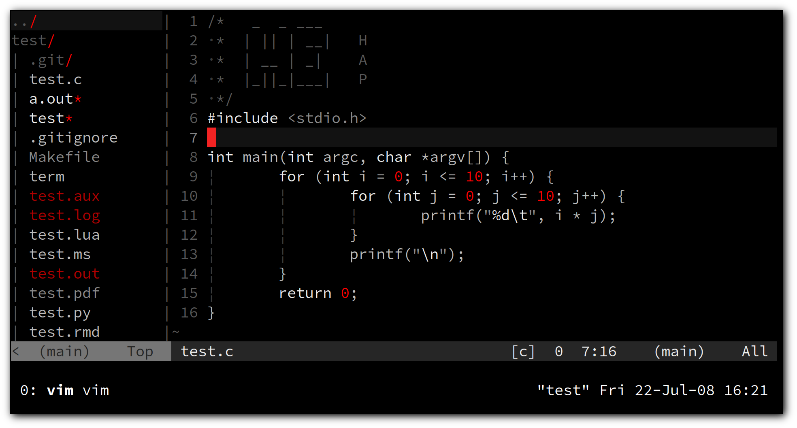
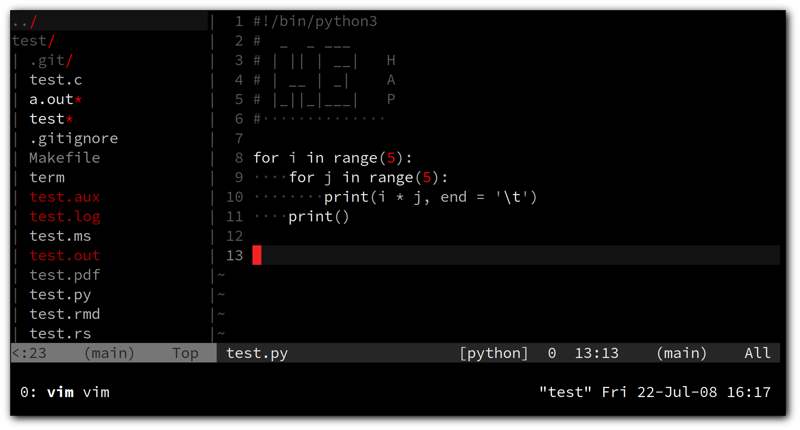
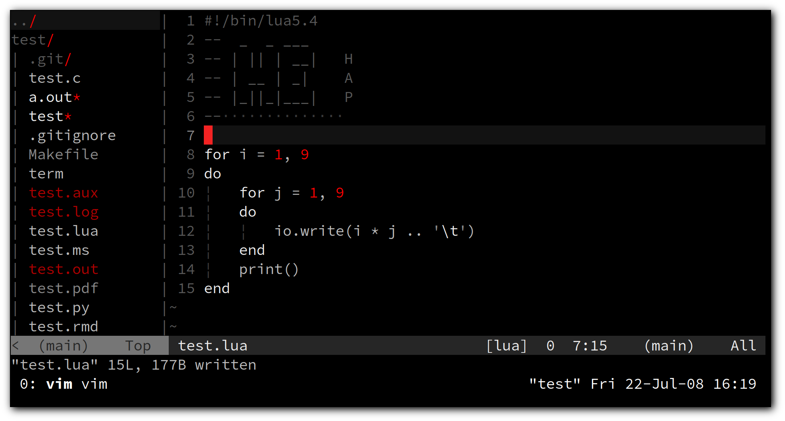

# vim

Hos's vim configuration

Vim will have separate colorschemes and configurations
in GUI, Terminal and tty in this setup.

- Terminal
    - colorscheme: hybrid [dark]
- tty
    - colorscheme: industry
- GUI [gvim/vim-gtk3]
    - font: Liberation Mono
    - colorscheme: hybrid_material [light]

```sh
if [[ ! -z "${questions}" ]]; then
    echo "Keep reading ;)"
else
    echo "Have fun and goodbye :*"
    exit 0
fi
```

```sh
for questions in ${mind}
do
    echo ${questions} 
done
```

Let me explain a little bit :)

## Files

I have all of my configurations in separate files.
One file for keybindings, another for
statusline configs and so on.
In each file, I have some kind of settings.

### vimrc

This is the init file which `vim` reads settings from this.
And I source all my config files in it.
Also there is a section, just an `if` statement to say

> if vim opened in a tty, set this colorscheme and do this

> if vim opened inside of a Terminal, do these and use this colorscheme

> and if vim opened in a GUI mode [gvim typically] use this font, and this colorscheme

### main.vim

This file contains some of basic settings like

- Line numbering
- No Vi compatibilities
- set clipboard
- show status line
- etc...

### abreviation.vim

This is the fun part. I have three functions in this file.

All these three functions do is
mapping some ascii characters like `•`, `→`, `⇒`
to some common symbols like `.`, `->`, `=>`
and let us to toggle [for enable and disable these maps]
between two functions.

One function to activate, one for deactivate,
and one for toggle between those two functions.

The keybinding for toggling is `<space><space>c` in normal mode.

### keybinds.vim

I keep most of my key mappings in this file.
Thinks like

- `<leader>ss` to execute `:setlocal spell!<CR>`
- `<leader>se` to execute `:set spelllang=en_us<CR>`
- `<C-p>` to execute `:set paste!`
- etc...

I'm used to have `\` as leader key.
You can set `mapleader` to something else like `,`.
See `keybinds.vim` file, line 8.

```vim
"" <Leader> key section
let mapleader='\'      " change the <Leader> Key
```

### skels.vim

If you want to set the leader key [or anything] to `,`
note that I have `,` set to read some template files located in
`$HOME/.vim/templates/` directory to the current file.

Take a look at `skels.vim` file, line 8, `g:skelkey` variable,
for changing the `g:skelkey` which I it set to `,` by default.

```vim
"" add ready-to-use text by .ext
let g:skelkey=','
```

### netrw.vim

Vim's built-in file manager `netrw` configs.

contains some `autocmd`s for

- Close netrw if it's the only opened buffer
- Start netrw at startup
	- To disable this functionality, simply set value `1` to the
	`g:NetrwIsOpen` variable in this file:
	```vim
	" open netrw on startup (0 = on, 1 = off)
	let g:NetrwIsOpen=1
	```

And functions for 

- Toggle netrw
- Refresh netrw to update the display

### extra.vim

This file, as you guess from it's name,
have some extra settings and features enabled.
Things like

- Auto fill `{ } [ ] ( )`
    - Has a keybinding to enable/disable
    - Fills markdown's `* *` and `_ _`
        - This will be only enabled on markdown files, and cannot be turned off [Didn't set that :)]
- some `omnifunc` configurations
    - like `set omnifunc=htmlcomplete#CompleteTags` for `html/xhtml` filetype
- don't expand tab in `make` filetype [makefiles]
- enable `filetype plugin` and `filetype indent`
- also it has the `plugins`

#### Plugins

`vim-plug` **is the plugin manager of my choice.**

Active plugins [requires `:PlugInstall` to install]

- 'Jorengarenar/miniSnip'
- 'xuhdev/vim-latex-live-preview', { 'for': 'tex' }
- 'vimwiki/vimwiki'
- 'lifepillar/vim-mucomplete'
- also some plugins which are commented out ;)

### oldcp.vim

This file is for compile/execute programs/scripts.

That's all you need to know but, if want to, you can take a look ;)

Syntax is like

```vim
autocmd FileType <File_type> nnoremap <Key_binding> :!<Command><CR>
```

### {status,simplestatus}.vim

This file[s] is just status line.

I do not use a plugin for this. It's all just vim's built-in status line.

### Other files

#### Plugin configs

- `minisnip.vim`
    - `<Ctrl-s><Ctrl-s>` to apply snippet
- `vi.vim`
    - It is a very very lightweight config file
    - It is not using any plugins
    - The most external tool it use is `netrw`
    - I did not included it in `vimrc` file
    - Give it a try: `vim -u $PWD/vi.vim ~/.bashrc`


There is another file called `Note.vim`,
this file is to use with two scripts `NoteMarkdown.sh` and `NoteBuild.sh`
for taking notes and building pdf[s] from that notes.

[I am thinking about a way to do it differently, but for now, it's all I got :)]

## Directories

There is also some directories in the `$HOME/.vim` dir, right?

Wanna know what are those?!

```sh
case $1 in
    yes)
    echo "Keep reading ;)"
		;;
    *)
    echo "Have a nice life, take care :*"
    exit 0
		;;
esac
```

### autoload/

The `vim-plug` plugin manager lives in this directory :)

### colors/

It is obvious right?
it contains colorschemes :)))

#### Available colors

1. 256_noir
1. ayu
1. codedark
1. dalton
1. deus
1. fogbell
1. genericdc-light
1. gruvbox
1. hybrid
1. materialbox
1. material
1. minimalist
1. molokai
1. monokai_pro
1. nord
1. onehalf
1. phoenix
1. simple-dark
1. solarized8
1. sunbather
1. xcode

### ftdetect/

Oh this one! I wrote a very small syntax highlighter
[about 5 line of code in total XD] for files with `.sent` extension.
In this directory, basically I told vim 

> Hey! `*.sent` files are a kind! they are `sent`

And in sent.vim file, I defined the color scheme [just has 3 or 4 lines, nothing serious]

### miniSnip/

Custom snippets written by me to use it with `minisnip` plugin

### plugged/

All the plugins will be stored [installed] here.

### spell/

If you install a new dictionary [which vim needs to download it]
guess now :)) it will keep the dictionary files here.

### templates/

This is where is keep my skeleton/template files, call them whatever you like
I don't care XD

## Screenshots

I like and use `hybrid` colorscheme.

#### C



#### C [gvim]


#### Python



#### Lua



Shout out to all people who I learnt from <3
